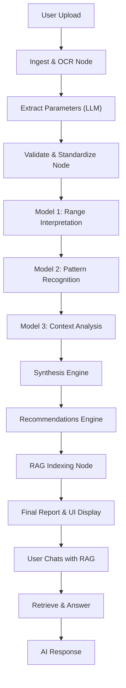

# 🩸 AI-Powered CBC Analyzer

A state-of-the-art Multi-Agent AI system designed to analyze Complete Blood Count (CBC) reports. This tool uses OCR, advanced Large Language Models (LLMs), and **RAG (Retrieval-Augmented Generation)** to scan, extract, interpret, and explain blood test results, providing clinical-grade insights and personalized health recommendations.

---

## 🏗️ Project Architecture
This project bridges the gap between complex medical data and patient understanding by using a **LangGraph** based agentic workflow.

**Key Features:**
*   **LLM Extraction**: Uses **Llama-3.3-70b** to read documents like a human doctor.
*   **Multi-Model Intelligence**: Specialized agents for Pattern Recognition, Context Analysis, and Report Synthesis.
*   **Context-Aware RAG Chatbot**: Allows users to chat with their report. Uniquely, the chatbot checks both the **vector database** (retrieved text chunks) AND the **full analysis state** (AI-synthesized patterns, risk assessment, and recommendations) to provide highly accurate answers.

---

## 🧠 Core Intelligence: LLM Extraction
The heart of the application is **`nodes/extract_parameters.py`**.

### How it works (Beginning to Last):
1.  **Input**: The LLM receives the raw text chunk from the OCR node.
2.  **Instruction**: It uses a specialized prompt that defines the "persona" of a medical data extractor.
3.  **Reasoning**: 
    *   It looks for key parameters (e.g., "Hemoglobin", "Hgb").
    *   It intelligently handles broken OCR (e.g., correcting "1 2 . 5" to "12.5").
    *   It normalizes units (e.g., converting "1.5 lakhs" to "150,000" for platelets).
4.  **Strict Output**: We enforce a **Pydantic Schema** (`ExtractionOutput`). This forces the LLM to return strictly formatted JSON with no conversational fluff.
5.  **Output**: The node returns a structured dictionary `{ "Hemoglobin": 13.5, ... }` ready for validation.

---

## ️ Visual Intelligence: OCR Extraction
Before the LLM can read, we must "see" the document. This happens in **`nodes/ingest_and_ocr.py`**.

### 1. Digital PDFs (The Fast Path)
*   We use **PyMuPDF (`fitz`)**.
*   It extracts text directly from the PDF layer. This is fast and 100% accurate for computer-generated reports.

### 2. Scanned Images / PDFs (The Hard Path)
*   If the file is an image (JPG/PNG) or a scanned PDF, we use **Tesseract OCR**.
*   **Preprocessing (`utils/ocr_utils.py`)**:
    *   **Grayscale**: We convert color images to black & white to remove noise.
    *   **Auto-Contrast**: We maximize the difference between text and background.
    *   **Upscaling**: We enlarge small images so Tesseract can see tiny fonts.
*   **Result**: A raw text string representing the visual content of the page.

---

## 🌊 Workflow Architecture
The application runs on a **LangGraph** pipeline, where data floats through a series of "Nodes".



### The Pipeline Steps:
1.  **Ingest & OCR**: Convert file to text.
2.  **Validation**: Check extracted numbers against known Reference Ranges (Low/Normal/High).
3.  **Pattern Recognition**: AI looks at all values together to find syndromes (e.g., Low Hb + Low MCV = Microcytic Anemia).
4.  **Context Analysis**: AI considers age/gender (e.g., "13 Hb is normal for a man, but excellent for a pregnant woman").
5.  **Synthesis**: Combines all logical findings into a coherent narrative.
6.  **Recommendations**: Generates dietary and lifestyle tips.
7.  **RAG Indexing**: Indexes the raw text into **Qdrant** (Vector DB) for the chatbot.

---

## 📂 Project File Guide
Here is how every file contributes to the project:

### 1. Root Directory
*   **`app.py`**: **Main Streamlit Application**. Runs the pipeline and RAG chat.
*   **`api.py`**: **FastAPI Backend**. Serves the React frontend.
*   **`requirements.txt`**: Dependency list.

### 2. `nodes/` (The Brain)
*   **`ingest_and_ocr.py`**: Router for pulling text from PDFs or Images.
*   **`extract_parameters.py`**: **The AI Extractor**. Uses Llama-3.3-70b to find data.
*   **`validate_standardize.py`**: Data quality checkpoint. Ensures values are numbers and matches them to reference ranges.
*   **`model1_interpretation.py`**: Checks if values are Low/Normal/High.
*   **`model2_patterns.py`**: "Doctor AI" #1 - Finds combined patterns (Anemia, Infection).
*   **`model3_context.py`**: "Doctor AI" #2 - Adjusts for patient demographics.
*   **`synthesis.py`**: "Writer AI" - Drafts the final report signature.
*   **`recommendations.py`**: "Advisor AI" - Gives health tips.
*   **`rag_node.py`**: **Chatbot Brain**. Handles indexing documents to Qdrant and retrieving answers using hybrid search (Vector + Full Analysis Context).

### 3. `graph/` (The Application Logic)
*   **`graph_state.py`**: Defines the data object (`ReportState`) that is passed between nodes. It's like the "memory" of the pipeline.
*   **`graph_builder.py`**: Connects the analysis nodes together.
*   **`rag_graph_builder.py`**: Defines the separate graph for RAG indexing.
*   **`rag_pipeline.py`**: Modular wrapper for executing the RAG chat loop.
*   **`run_pipeline.py`**: The trigger function that starts the graph execution.

### 4. `utils/` (Helpers)
*   **`llm_utils.py`**: Configures the connection to Groq API.
*   **`ocr_utils.py`**: Image processing helper for Tesseract.
*   **`reference_ranges.py`**: Reads the medical database.

---

## 💻 Frontend Architecture (New Premium UI)
The project now features a modern, high-performance web interface built with:
*   **React + Vite**: For lightning-fast performance.
*   **Tailwind CSS**: For a sleek, dark-themed "Glassmorphism" design.
*   **Framer Motion**: For fluid animations and interactive feedback.
*   **Firebase Auth**: For secure Google Sign-In and user management.

**Key Dashboard Features:**
- **Scroll-aware Header**: Fluid navigation.
- **Detailed Reports**: Beautifully styled Markdown rendering for Synthesis and Risk.
- **History Management**: Re-analyze previous reports instantly.
- **RAG Chat**: Ask questions directly to your report with full context awareness.

---

## 🚀 Quick Start Guide

This project is managed using **uv** for fast and reliable Python environment management.

### Prerequisites
*   **uv** (Modern Python package manager) -> `pip install uv`
*   **Node.js 18+** (For the frontend)
*   **Tesseract OCR** (Required for image processing)

### 1. Backend Setup (Python)

```bash
# 1. Initialize project and create virtual environment using uv
uv init
uv venv

# 2. Activate the environment
# On Windows:
.venv\Scripts\activate
# On Mac/Linux:
source .venv/bin/activate

# 3. Install dependencies
uv pip install -r requirements.txt

# 4. Setup Environment Variables
# Create a .env file in the root directory and add:
# GROQ_API_KEY=your_key_here
# QDRANT_URL=your_qdrant_cloud_url (Optional, defaults to local disk)
# QDRANT_API_KEY=your_qdrant_key (Optional)
```

**Running the Backend API:**
```bash
# Start the FastAPI server (api.py)
# This will listen for requests from the React Frontend
python api.py
```

*(Optional) Run the Streamlit Prototype:*
```bash
streamlit run app.py
```

### 2. Frontend Setup (React)

Open a new terminal and navigate to the `frontend` folder:

```bash
cd frontend

# 1. Install dependencies
npm install

# 2. Setup Frontend Environment
# Create a .env file in 'frontend/' and add:
# VITE_FIREBASE_API_KEY=your_api_key
# VITE_FIREBASE_AUTH_DOMAIN=your_project.firebaseapp.com
# VITE_FIREBASE_PROJECT_ID=your_project_id
# VITE_FIREBASE_STORAGE_BUCKET=your_bucket.appspot.com
# VITE_FIREBASE_MESSAGING_SENDER_ID=your_sender_id
# VITE_FIREBASE_APP_ID=your_app_id
# VITE_API_URL=http://localhost:8000

# 3. Start the Development Server
npm run dev
```

Visit `http://localhost:5173` to launch the application.

---

**Developed by J. Likith Sagar & Team**
*AI Automation Project*
