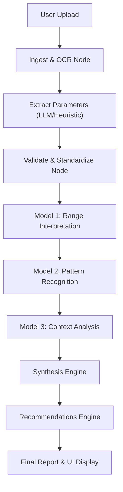

# 🩸 AI-Powered CBC Analyzer

A state-of-the-art Multi-Agent AI system designed to analyze Complete Blood Count (CBC) reports. This tool uses OCR and advanced Large Language Models (LLMs) to scan, extract, interpret, and explain blood test results, providing clinical-grade insights and personalized health recommendations.

---

## 🏗️ How We Built This Project (From Scratch to Complete)
This project was built to bridge the gap between complex medical data and patient understanding. We started with a simple goal: upload a PDF/Image of a blood report and get a clear, human-readable summary.

**Evolution:**
1.  **Phase 1: Heuristic MVP**: Initially, we used Regex and Fuzzy Matching to scrape numbers from text. It worked for perfect PDFs but failed on skewed scans or complex tables.
2.  **Phase 2: Agentic Workflow**: We introduced **LangGraph** to create a modular pipeline. Instead of one giant script, we broke the logic into "Nodes" (Ingestion, Interpretation, Synthesis).
3.  **Phase 3: The LLM Revolution**: We replaced the fragile Regex logic with **Llama-3.3-70b**. Now, instead of hunting for keywords, the AI *reads* the document like a human doctor, understanding context, units, and nuances.
4.  **Phase 4: Multi-Model Intelligence**: We added specialized sub-agents:
    *   **Pattern Recognition Agent**: Spot clinical patterns (e.g., Iron Deficiency Anemia).
    *   **Context Agent**: Adjusts findings based on Patient Age & Gender.
    *   **Synthesis Agent**: Writes the final "Senior Consultant" style report.

---

## 🧠 Core Intelligence: LLM Extraction
The heart of the application is **`nodes/extract_parameters.py`**.

### How it works (Beginning to Last):
1.  **Input**: The LLM receives the raw text chunk from the OCR node.
2.  **Instruction**: It uses a specialized prompt that defines the "persona" of a medical data extractor.
3.  **Reasoning**: 
    *   It looks for key parameters (e.g., "Hemoglobin", "Hgb").
    *   It intelligently handles broken OCR (e.g., correcting "1 2 . 5" to "12.5").
    *   It normalizes units (e.g., converting "1.5 lakhs" to "150,000" for platelets).
4.  **Strict Output**: We enforce a **Pydantic Schema** (`ExtractionOutput`). This forces the LLM to return strictly formatted JSON with no conversational fluff.
5.  **Output**: The node returns a structured dictionary `{ "Hemoglobin": 13.5, ... }` ready for validation.

---

## �️ Visual Intelligence: OCR Extraction
Before the LLM can read, we must "see" the document. This happens in **`nodes/ingest_and_ocr.py`**.

### 1. Digital PDFs (The Fast Path)
*   We use **PyMuPDF (`fitz`)**.
*   It extracts text directly from the PDF layer. This is fast and 100% accurate for computer-generated reports.

### 2. Scanned Images / PDFs (The Hard Path)
*   If the file is an image (JPG/PNG) or a scanned PDF, we use **Tesseract OCR**.
*   **Preprocessing (`utils/ocr_utils.py`)**:
    *   **Grayscale**: We convert color images to black & white to remove noise.
    *   **Auto-Contrast**: We maximize the difference between text and background.
    *   **Upscaling**: We enlarge small images so Tesseract can see tiny fonts.
*   **Result**: A raw text string representing the visual content of the page.

---

## 🌊 Workflow Architecture
The application runs on a **LangGraph** pipeline, where data floats through a series of "Nodes".

### The Pipeline Steps:
1.  **Ingest & OCR**: Convert file to text.
2.  **Validation**: Check extracted numbers against known Reference Ranges (Low/Normal/High).
3.  **Pattern Recognition**: AI looks at all values together to find syndromes (e.g., Low Hb + Low MCV = Microcytic Anemia).
4.  **Context Analysis**: AI considers age/gender (e.g., "13 Hb is normal for a man, but excellent for a pregnant woman").
5.  **Synthesis**: Combines all logical findings into a coherent narrative.
6.  **Recommendations**: Generates dietary and lifestyle tips.

---

## 📂 Project File Guide
Here is how every file contributes to the project:

### 1. Root Directory
*   **`app.py`**: **Main Application**. Runs the **LLM (AI)** pipeline. Contains the Streamlit UI code for the dashboard, file uploader, and visualization cards.
*   **`main.py`**: **Heuristic Application**. Runs the **Regex (Legacy)** pipeline. Used for comparing the old method vs. the new AI method.
*   **`requirements.txt`**: Dependency list (`streamlit`, `langchain`, `pydantic`, etc.).

### 2. `nodes/` (The Brain)
*   **`ingest_and_ocr.py`**: Router for pulling text from PDFs or Images.
*   **`extract_parameters.py`**: **The AI Extractor**. Uses Llama-3.3-70b to find data.
*   **`validate_standardize.py`**: Data quality checkpoint. Ensures values are numbers and matches them to reference ranges.
*   **`model1_interpretation.py`**: Checks if values are Low/Normal/High.
*   **`model2_patterns.py`**: "Doctor AI" #1 - Finds combined patterns (Anemia, Infection).
*   **`model3_context.py`**: "Doctor AI" #2 - Adjusts for patient demographics.
*   **`synthesis.py`**: "Writer AI" - Drafts the final report signature.
*   **`recommendations.py`**: "Advisor AI" - Gives health tips.

### 3. `app/` (Orchestration)
*   **`graph_state.py`**: The shared memory object (`ReportState`) passed between all nodes.
*   **`graph_builder.py`**: Defines the workflow (A connects to B connects to C).
*   **`run_pipeline.py`**: Function to start the engine.

### 4. `heuristic/` (The Old Way)
*   **`extract_parameters_heuristic.py`**: The old code that used Regex loops to find data. Preserved for legacy support.
*   **`graph_builder_heuristic.py`**: Graph definition for the heuristic version.

### 5. `utils/` (Helpers)
*   **`llm_utils.py`**: Configures the connection to Groq API.
*   **`ocr_utils.py`**: Image processing helper for Tesseract.
*   **`reference_ranges.py`**: Reads the medical database.

### 6. `configs/`
*   **`reference_ranges.json`**: The database of normal blood values (Men vs Women).

---
**Developed by Likith Sagar & Team**
*AI Automation Project*
