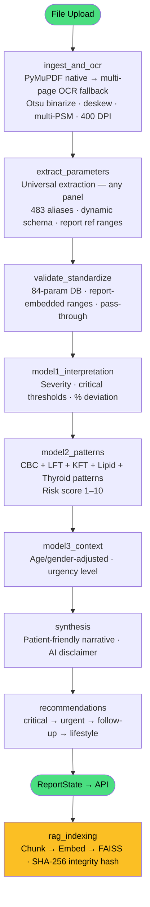

# Health AI — Universal Blood Report Analyzer

An AI-powered blood report analyzer that handles **any blood test panel** from any lab worldwide. Upload a PDF or image, get a full multi-model clinical analysis, then ask follow-up questions via an intelligent chat interface.

---

## Features

- **Universal Report Support** — Analyzes CBC, LFT, KFT/RFT, Lipid Panel, Thyroid, Coagulation, Iron Studies, HbA1c/Diabetes, Electrolytes, and mixed/comprehensive panels. Not limited to CBC.
- **Worldwide Lab Format Compatibility** — Handles Indian path labs (NABL), US (CLIA), European (ISO 15189), and other regional formats with different number conventions, unit styles, and table layouts.
- **Dynamic Parameter Extraction** — 483-alias dictionary maps every known raw lab name variant (SGPT→ALT, TLC→Total WBC, FBS→Fasting Blood Glucose, etc.) to canonical names. Unknown parameters pass through using the report's own embedded reference ranges.
- **84-Parameter Reference Database** — Curated gender-adjusted reference ranges for CBC, LFT, KFT, Lipid, Thyroid, Diabetes, Iron Studies, Coagulation, Electrolytes, Vitamins, and more.
- **Multi-Model Clinical Analysis** — Severity classification (mild/moderate/severe/critical), percent deviation from reference midpoint, pattern detection across all panels, risk scoring (1–10), age/gender-adjusted contextual analysis, and prioritized recommendations.
- **Enhanced OCR Pipeline** — Otsu binarization, deskew correction, multi-PSM Tesseract strategy (PSM 6/4/11), 400 DPI rendering. Best result selected per page automatically.
- **Rate-Limited LLM Usage** — Quality model (`llama-3.3-70b-versatile`) for extraction and reasoning; fast model (`llama-3.1-8b-instant`) for structured tasks. Separate Groq rate-limit buckets prevent 429 chains.
- **RAG Chatbot** — Ask natural-language questions about your report; answers grounded in your specific results via FAISS vector search + conversation history (last 10 turns). Chat history persisted to Supabase per report.
- **Secure Authentication** — Clerk-based auth (Google + email/password) protecting all routes. Landing page is publicly accessible.
- **Rate Limiting** — `/analyze` capped at 10 req/min, `/chat` at 30 req/min per IP.
- **User History** — Report metadata and chat history stored in Supabase (PostgreSQL).
- **Production Hardened** — Dockerized with Nginx, CI/CD to AWS EC2 via GitHub Actions. Structured JSON logging, health check endpoint, session TTL cleanup, file type + size validation.

---

## Tech Stack

| Layer | Technology |
|---|---|
| **Frontend** | Next.js 15 (App Router) + TypeScript |
| **UI** | Tailwind CSS v3 + Framer Motion + Plus Jakarta Sans |
| **Authentication** | Clerk (`@clerk/nextjs`) |
| **Metadata DB** | Supabase (PostgreSQL) |
| **Backend** | FastAPI + Uvicorn |
| **Pipeline** | LangGraph (8-node DAG) |
| **LLM — Quality** | Groq `llama-3.3-70b-versatile` (extraction, reasoning, synthesis) |
| **LLM — Fast** | Groq `llama-3.1-8b-instant` (structured pattern tasks, fallback) |
| **Embeddings** | HuggingFace `sentence-transformers/all-MiniLM-L6-v2` |
| **Vector Store** | FAISS (in-process, persisted to Docker volume) |
| **OCR** | Tesseract + PyMuPDF (fitz) |
| **Containerization** | Docker + Docker Compose |
| **Reverse Proxy** | Nginx |
| **CI/CD** | GitHub Actions → Docker Hub → AWS EC2 |

---

## Architecture

### Request Flow

```
Browser → Nginx → Next.js (frontend:3000)
                    ├── POST /api/upload  → Clerk auth → FastAPI /analyze → LangGraph pipeline → RAG indexing (FAISS)
                    ├── GET  /api/reports → Clerk auth → Supabase query (user's past reports)
                    ├── GET  /api/reports/[id] → Clerk auth → Supabase query (specific report)
                    └── POST /api/query   → Clerk auth → FastAPI /chat → RAG retrieval + Groq LLM → save to Supabase
```

### LangGraph Pipeline (8-node DAG)


```mermaid
flowchart TD
    A([File Upload]) --> B[ingest_and_ocr\nPyMuPDF native → multi-page OCR fallback\nOtsu binarize · deskew · multi-PSM · 400 DPI]
    B --> C[extract_parameters\nUniversal extraction — any panel\n483 aliases · dynamic schema · report ref ranges]
    C --> D[validate_standardize\n84-param DB · report-embedded ranges · pass-through]
    D --> E[model1_interpretation\nSeverity · critical thresholds · % deviation]
    E --> F[model2_patterns\nCBC + LFT + KFT + Lipid + Thyroid patterns\nRisk score 1–10]
    F --> G[model3_context\nAge/gender-adjusted · urgency level]
    G --> H[synthesis\nPatient-friendly narrative · AI disclaimer]
    H --> I[recommendations\ncritical → urgent → follow-up → lifestyle]
    I --> K([ReportState → API])
    K --> J[rag_indexing\nChunk → Embed → FAISS · SHA-256 integrity hash]

    style A fill:#4ade80,color:#000
    style K fill:#4ade80,color:#000
    style J fill:#fbbf24,color:#000
```

#### Node responsibilities

| Node | Output |
|---|---|
| `ingest_and_ocr` | `raw_text` — native PDF text or multi-page OCR |
| `extract_parameters` | `extracted_params`, `patient_info`, `report_type` — all lab values + demographics |
| `validate_standardize` | `validated_params` — gender-adjusted LOW/NORMAL/HIGH flags, scale-normalized |
| `model1_interpretation` | `param_interpretation` — severity, % deviation, critical alerts |
| `model2_patterns` | `patterns`, `risk_assessment` — clinical syndromes + risk score |
| `model3_context` | `context_analysis` — demographic context, adjusted concerns, urgency |
| `synthesis` | `synthesis_report` — patient-friendly narrative with disclaimer |
| `recommendations` | `recommendations` — prioritized action list with clinical rationale |

### Supported Blood Test Panels

| Panel | Parameters Extracted |
|---|---|
| **CBC / FBC** | Hb, RBC, PCV/HCT, MCV, MCH, MCHC, RDW, WBC/TLC, Platelets, Differential (N/L/M/E/B %), Absolute counts, ESR, MPV, PDW, PCT |
| **LFT** | ALT/SGPT, AST/SGOT, ALP, GGT, Total/Direct/Indirect Bilirubin, Total Protein, Albumin, Globulin, A/G Ratio, LDH |
| **KFT / RFT** | Creatinine, BUN, Blood Urea, Uric Acid, eGFR |
| **Electrolytes** | Na, K, Cl, HCO₃, Ca, Phosphorus, Mg |
| **Lipid Panel** | Total Cholesterol, Triglycerides, HDL, LDL, VLDL, Non-HDL, TC/HDL Ratio |
| **Thyroid** | TSH, Free T3, Total T3, Free T4, Total T4 |
| **Diabetes** | FBS/FPG, PPBS, Random Glucose, HbA1c |
| **Iron Studies** | Serum Iron, TIBC, Transferrin Saturation, Ferritin |
| **Coagulation** | PT, INR, aPTT, Fibrinogen, D-Dimer, Bleeding/Clotting Time |
| **Inflammatory** | CRP, hsCRP |
| **Vitamins** | Vitamin D, Vitamin B12, Folate |
| **Other** | Amylase, Lipase, PSA |

### Pattern Detection (model2_patterns)

| Panel | Patterns Detected |
|---|---|
| **CBC** | Microcytic/Macrocytic/Normocytic Anemia, Iron Deficiency Anemia, Leukopenia/Leukocytosis, Neutropenia, Lymphopenia, Pancytopenia, Acute Infection, Thrombocytopenia/cytosis, Polycythemia |
| **LFT** | Hepatocellular Injury, Cholestatic Pattern, Obstructive Jaundice, Hepatic Synthetic Defect, Mixed Liver Disease |
| **KFT** | Acute/Chronic Kidney Disease, Hyperuricemia, Hyponatremia, Hyperkalemia |
| **Lipid** | Dyslipidemia, Hypertriglyceridemia, Low HDL Syndrome, Metabolic Syndrome |
| **Thyroid** | Hypothyroidism, Hyperthyroidism, Subclinical Hypo/Hyperthyroid |
| **Diabetes** | Impaired Fasting Glucose, Diabetes Mellitus, Poor Glycemic Control |

### RAG Chat Flow


```mermaid
flowchart LR
    U([User Question]) --> Q[Next.js /api/query]
    Q --> F[FastAPI /chat]
    F --> R[rag_retrieve_and_answer]
    R --> V[(FAISS Index)]
    V --> E[Top-k similar chunks]
    E --> L[Groq llama-3.3-70b + context + history]
    L --> A([Answer + saved to Supabase])
```

---

## Project Structure

```
health_ai_project/
├── api.py                        # FastAPI app (/analyze, /chat, /health)
├── app.py                        # Streamlit alternative UI
├── requirements.txt
├── Dockerfile
├── docker-compose.yml            # Dev stack
├── docker-compose.prod.yml       # Production stack
│
├── graph/
│   ├── graph_builder.py          # 8-node LangGraph DAG
│   ├── graph_state.py            # ReportState (includes report_type field)
│   ├── run_pipeline.py           # Pipeline entry point
│   ├── rag_graph_builder.py
│   └── rag_pipeline.py
│
├── nodes/
│   ├── ingest_and_ocr.py         # PDF/image ingestion
│   ├── extract_parameters.py     # Universal extraction · 483 aliases · dynamic schema
│   ├── validate_standardize.py   # 84-param DB + report ref range fallback
│   ├── model1_interpretation.py  # Severity + critical alerts
│   ├── model2_patterns.py        # Multi-panel pattern detection (CBC/LFT/KFT/Lipid/Thyroid/Diabetes)
│   ├── model3_context.py         # Demographic context + urgency
│   ├── synthesis.py              # Narrative report
│   ├── recommendations.py        # Prioritized recommendations
│   └── rag_node.py               # FAISS indexing + RAG query
│
├── utils/
│   ├── llm_utils.py              # get_llm (70b quality) + get_fast_llm (8b fast)
│   ├── ocr_utils.py              # Otsu · deskew · multi-PSM · 400 DPI
│   └── reference_ranges.py
│
├── configs/
│   └── reference_ranges.json     # 84 parameters across all panels (gender-adjusted)
│
└── frontend/
    ├── app/
    │   ├── layout.tsx            # Root layout (Clerk, afterSignOutUrl="/")
    │   ├── page.tsx              # Landing page (publicly accessible)
    │   └── api/
    │       ├── upload/route.ts   # POST → /analyze (authenticated)
    │       ├── query/route.ts    # POST → /chat + chat history saved to Supabase
    │       ├── reports/route.ts
    │       └── reports/[id]/route.ts
    ├── components/
    │   ├── Dashboard.tsx         # Main app UI (logo → home link, chat full-height layout)
    │   ├── ChatComponent.tsx     # Chat UI (initialChat prop, history persistence)
    │   └── ui/
    │       ├── AnalysisProgress.tsx
    │       ├── CbcChart.tsx
    │       ├── ConfirmModal.tsx
    │       └── Toast.tsx
    ├── lib/
    │   ├── supabase.ts
    │   └── sanitize.ts
    ├── middleware.ts              # Clerk auth middleware
    ├── proxy.ts                  # Route matcher (/ is public)
    ├── Dockerfile
    └── nginx.conf
```

---

## Local Development Setup

### Prerequisites

- Node.js 18+
- Python 3.10+
- Docker & Docker Compose
- Tesseract OCR (`sudo apt install tesseract-ocr` on Linux; installer on Windows)
- Optional: `scipy` (`pip install scipy`) enables OCR deskew correction

### 1. Clone

```bash
git clone https://github.com/Likithsatya192/AI-Powered-CBC-Analyzer.git
cd health_ai_project
```

### 2. Environment Variables

**Root `.env`** (backend):
```env
GROQ_API_KEY=your_groq_api_key
ALLOWED_ORIGINS=http://localhost:3000
FAISS_INDEX_DIR=faiss_index           # optional, default: faiss_index/
TESSERACT_CMD=/usr/bin/tesseract      # optional, auto-detected on Windows
```

**`frontend/.env.local`**:
```env
NEXT_PUBLIC_CLERK_PUBLISHABLE_KEY=pk_...
CLERK_SECRET_KEY=sk_...
NEXT_PUBLIC_SUPABASE_URL=https://your-project.supabase.co
NEXT_PUBLIC_SUPABASE_ANON_KEY=your_anon_key
FASTAPI_URL=http://localhost:8000     # http://backend:8000 inside Docker
```

> **Security:** Never commit `.env` or `frontend/.env.local`. Both are in `.gitignore`.

### 3. Run with Docker (recommended)

```bash
docker-compose up --build
```

| Service | URL |
|---|---|
| Frontend | http://localhost:3000 |
| Backend API | http://localhost:8000 |
| Swagger Docs | http://localhost:8000/docs |

### 4. Run without Docker

```bash
# Backend
pip install -r requirements.txt
uvicorn api:app --reload

# Frontend (separate terminal)
cd frontend
npm install
npm run dev
```

---

## Supabase Setup

### Create `reports` table

```sql
create table reports (
  id                   uuid primary key default gen_random_uuid(),
  user_id              text not null,
  filename             text not null,
  title                text,
  rag_collection_name  text,
  risk_score           integer,
  analysis_data        jsonb not null,
  created_at           timestamptz default now()
);

create index reports_user_id_idx    on reports(user_id);
create index reports_created_at_idx on reports(created_at desc);
```

The `analysis_data.chat_history` key is updated in-place by `/api/query` after each chat message.

### Disable RLS

```sql
alter table reports disable row level security;
```

---

## Deployment (AWS EC2)

CI/CD via `.github/workflows/deploy.yml`. On every push to `main`:
1. Builds backend + frontend Docker images
2. Pushes to Docker Hub
3. SSH into EC2 → `docker-compose -f docker-compose.prod.yml up -d`

### Required GitHub Secrets

| Secret | Description |
|---|---|
| `DOCKER_USERNAME` | Docker Hub username |
| `DOCKER_PASSWORD` | Docker Hub access token |
| `EC2_HOST` | EC2 public IP or DNS |
| `EC2_USERNAME` | EC2 SSH user |
| `EC2_KEY` | Private SSH key |
| `GROQ_API_KEY` | Groq API key |
| `NEXT_PUBLIC_CLERK_PUBLISHABLE_KEY` | Clerk publishable key |
| `CLERK_SECRET_KEY` | Clerk secret key |
| `NEXT_PUBLIC_SUPABASE_URL` | Supabase project URL |
| `NEXT_PUBLIC_SUPABASE_ANON_KEY` | Supabase anon key |

---

## API Reference

| Method | Endpoint | Rate Limit | Description |
|---|---|---|---|
| `POST` | `/analyze` | 10/min/IP | Upload blood report file; returns full analysis |
| `POST` | `/chat` | 30/min/IP | RAG-based Q&A about a report |
| `GET` | `/health` | — | Health check; returns `200 ok` or `503 degraded` |
| `GET` | `/docs` | — | Swagger UI |

### `/analyze` Response

```json
{
  "report_type": "CBC",
  "risk_score": 7,
  "risk_rationale": ["Hemoglobin critically low at 6.8 g/dL"],
  "param_interpretation": {
    "Hemoglobin": { "value": 6.8, "unit": "g/dL", "status": "low", "severity": "critical", "is_critical": true, "deviation_pct": -51.0 }
  },
  "synthesis_report": "...",
  "recommendations": ["[CRITICAL] Seek emergency care immediately..."],
  "patterns": ["Microcytic Anemia"],
  "context_analysis": { "urgency": "urgent", "analysis": "...", "adjusted_concerns": "..." },
  "rag_collection_name": "report_abc123",
  "errors": []
}
```

---

## LLM Model Configuration

| Role | Groq Model ID | Used in nodes |
|---|---|---|
| Quality (70B) | `llama-3.3-70b-versatile` | `extract_parameters`, `model3_context`, `synthesis`, `recommendations` |
| Fast (8B) | `llama-3.1-8b-instant` | `model2_patterns`, fallback for quality model failures |

Separate Groq rate-limit buckets per model — prevents 429 cascades across sequential pipeline calls.

---

## Notes

- **Chat History** — Persisted per-report in Supabase (`analysis_data.chat_history`). In-memory RAG session expires after 1 hour of inactivity.
- **FAISS Indexes** — Persisted to `faiss_index/<namespace>/` via Docker volume. SHA-256 hashed on write, verified before load.
- **Multi-page OCR** — All PDF pages processed independently with Otsu binarization + multi-PSM strategy. Best result per page selected by character count.
- **Pass-through Parameters** — Parameters absent from the reference database are validated using the report's own embedded reference ranges. Parameters with neither are passed downstream with `UNKNOWN` flag — still visible in the analysis.
- **AI Disclaimer** — All synthesis reports include a disclaimer that output is AI-generated and does not constitute medical advice.

---

## Author

**Likith Sagar**  
GitHub: [Likithsatya192](https://github.com/Likithsatya192)
