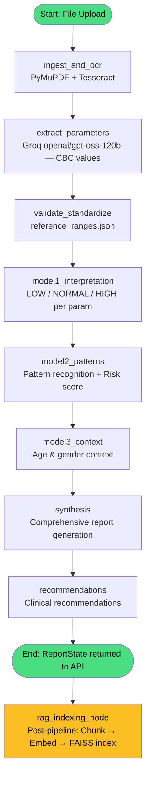
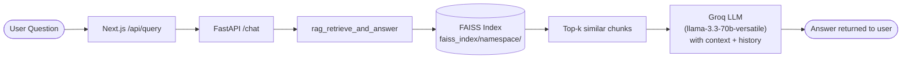
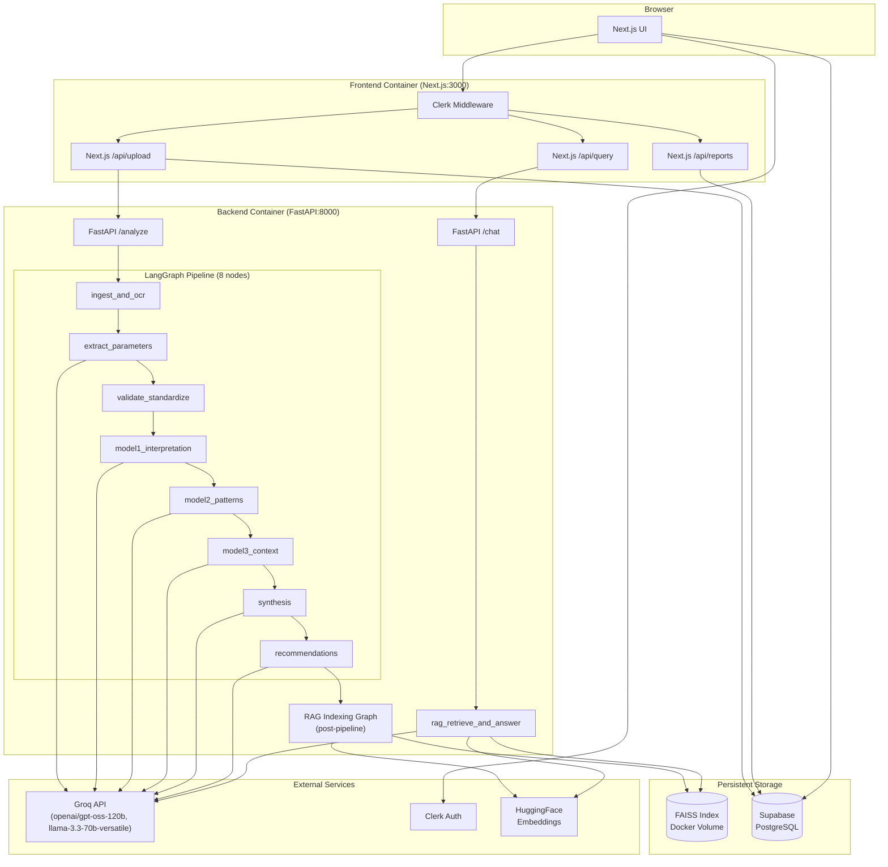

# Health AI — CBC Report Analyzer

An AI-powered Complete Blood Count (CBC) report analyzer with RAG-based Q&A. Upload a blood report (PDF or image), get a full multi-model analysis, then ask follow-up questions via an intelligent chat interface.

---

## Features

- **Automated CBC Analysis** — Upload a PDF or image; the 8-node LangGraph pipeline extracts, validates, interprets, and synthesizes the report.
- **Multi-Model Insights** — Per-parameter classification (LOW/NORMAL/HIGH), pattern recognition, risk scoring, contextual analysis (age/gender), and clinical recommendations.
- **RAG Chatbot** — Ask natural-language questions about your report; answers are grounded in your specific results via FAISS vector search.
- **Secure Authentication** — Clerk-based auth (Google + email/password) protecting all routes.
- **User History** — Report metadata stored in Supabase (PostgreSQL).
- **Production Ready** — Fully Dockerized with Nginx, CI/CD to AWS EC2 via GitHub Actions.

---

## Tech Stack

| Layer | Technology |
|---|---|
| **Frontend** | Next.js 16 (App Router) + TypeScript |
| **UI Styling** | Tailwind CSS v3 + Framer Motion + Plus Jakarta Sans |
| **Authentication** | Clerk (`@clerk/nextjs`) |
| **Metadata DB** | Supabase (PostgreSQL) |
| **Backend** | FastAPI + Uvicorn |
| **Pipeline** | LangGraph (8-node DAG) |
| **LLM** | Groq API (`openai/gpt-oss-120b` for analysis, `llama-3.3-70b-versatile` for RAG) |
| **Embeddings** | HuggingFace `sentence-transformers/all-MiniLM-L6-v2` |
| **Vector Store** | FAISS (in-process, persisted to Docker volume) |
| **OCR** | Tesseract + PyMuPDF (fitz) |
| **Containerization** | Docker + Docker Compose |
| **Reverse Proxy** | Nginx |
| **CI/CD** | GitHub Actions → Docker Hub → AWS EC2 |

---

## Architecture

### Request Flow

```
Browser → Nginx → Next.js (frontend:3000)
                    ├── POST /api/upload  →  Clerk auth check  →  FastAPI /analyze  →  LangGraph pipeline → RAG indexing (FAISS)
                    ├── GET  /api/reports →  Clerk auth check  →  Supabase query (user's past reports)
                    ├── GET  /api/reports/[id] → Clerk auth check → Supabase query (specific report details)
                    └── POST /api/query   →  Clerk auth check  →  FastAPI /chat     →  RAG retrieval + Groq LLM → answer
```

### LangGraph Pipeline (8-node DAG)


```mermaid
flowchart TD
    A([Start: File Upload]) --> B[ingest_and_ocr\nPyMuPDF + Tesseract]
    B --> C[extract_parameters\nGroq openai/gpt-oss-120b — CBC values]
    C --> D[validate_standardize\nreference_ranges.json]
    D --> E[model1_interpretation\nLOW / NORMAL / HIGH per param]
    E --> F[model2_patterns\nPattern recognition + Risk score]
    F --> G[model3_context\nAge & gender context]
    G --> H[synthesis\nComprehensive report generation]
    H --> I[recommendations\nClinical recommendations]
    I --> K([End: ReportState returned to API])
    
    K --> J[rag_indexing_node\nPost-pipeline: Chunk → Embed → FAISS index]

    style A fill:#4ade80,color:#000
    style K fill:#4ade80,color:#000
    style J fill:#fbbf24,color:#000
```

*Note: The `rag_indexing_node` is invoked after the main 8-node pipeline completes, not as part of the LangGraph DAG.*

### RAG Chat Flow


```mermaid
flowchart LR
    U([User Question]) --> Q[Next.js /api/query]
    Q --> F[FastAPI /chat]
    F --> R[rag_retrieve_and_answer]
    R --> V[(FAISS Index\nfaiss_index/namespace/)]
    V --> E[Top-k similar chunks]
    E --> L["Groq LLM\n(llama-3.3-70b-versatile)\nwith context + history"]
    L --> A([Answer returned to user])
```

### Full System Architecture


```mermaid
flowchart TD
    subgraph Client["Browser"]
        UI[Next.js UI]
    end

    subgraph Frontend["Frontend Container (Next.js:3000)"]
        MW[Clerk Middleware]
        API_U["Next.js /api/upload"]
        API_Q["Next.js /api/query"]
        API_R["Next.js /api/reports"]
    end

    subgraph Backend["Backend Container (FastAPI:8000)"]
        AZ["FastAPI /analyze"]
        CH["FastAPI /chat"]
        subgraph Pipeline["LangGraph Pipeline (8 nodes)"]
            N1[ingest_and_ocr]
            N2[extract_parameters]
            N3[validate_standardize]
            N4[model1_interpretation]
            N5[model2_patterns]
            N6[model3_context]
            N7[synthesis]
            N8[recommendations]
        end
        RAG_IDX["RAG Indexing Graph\n(post-pipeline)"]
        RAG[rag_retrieve_and_answer]
    end

    subgraph Storage["Persistent Storage"]
        FAISS[(FAISS Index\nDocker Volume)]
        SB[(Supabase\nPostgreSQL)]
    end

    subgraph External["External Services"]
        GROQ["Groq API\n(openai/gpt-oss-120b, llama-3.3-70b-versatile)"]
        CLERK[Clerk Auth]
        HF[HuggingFace\nEmbeddings]
    end

    UI --> MW --> API_U & API_Q & API_R
    API_U --> AZ --> N1 --> N2 --> N3 --> N4 --> N5 --> N6 --> N7 --> N8
    N8 --> RAG_IDX
    N2 & N4 & N5 & N6 & N7 & N8 --> GROQ
    RAG_IDX --> FAISS
    RAG_IDX --> HF
    API_U --> SB
    API_Q --> CH --> RAG --> FAISS
    RAG --> GROQ
    RAG --> HF
    API_R --> SB
    UI --> CLERK
    UI --> SB
```

---

## Project Structure

```
health_ai_project/
├── api.py                        # FastAPI app (/analyze, /chat)
├── app.py                        # Streamlit alternative UI
├── requirements.txt              # Python dependencies
├── Dockerfile                    # Backend container
├── docker-compose.yml            # Dev stack
├── docker-compose.prod.yml       # Production stack
│
├── graph/
│   ├── graph_builder.py          # LangGraph 8-node DAG
│   ├── graph_state.py            # ReportState Pydantic model
│   ├── run_pipeline.py           # Pipeline entry point
│   ├── rag_graph_builder.py      # RAG indexing sub-graph
│   └── rag_pipeline.py           # RAG pipeline wrapper (Streamlit)
│
├── nodes/
│   ├── ingest_and_ocr.py
│   ├── extract_parameters.py
│   ├── validate_standardize.py
│   ├── model1_interpretation.py
│   ├── model2_patterns.py
│   ├── model3_context.py
│   ├── synthesis.py
│   ├── recommendations.py
│   └── rag_node.py               # FAISS indexing + RAG query
│
├── utils/
│   ├── llm_utils.py              # Groq LLM wrapper
│   ├── ocr_utils.py
│   └── reference_ranges.py
│
├── configs/
│   └── reference_ranges.json     # CBC normal ranges by gender/age
│
└── frontend/
    ├── app/
    │   ├── layout.tsx            # Root layout (Clerk provider)
    │   ├── page.tsx              # Home page
    │   ├── dashboard/page.tsx    # Protected dashboard
    │   ├── sign-in/              # Clerk sign-in route
    │   ├── sign-up/              # Clerk sign-up route
    │   └── api/
    │       ├── upload/route.ts   # POST — Authenticated proxy → /analyze
    │       ├── query/route.ts    # POST — Authenticated proxy → /chat
    │       ├── reports/route.ts  # GET — Fetch user's report history from Supabase
    │       └── reports/[id]/route.ts # GET/DELETE — Fetch or delete specific report
    ├── components/
    │   ├── Dashboard.tsx
    │   ├── ChatComponent.tsx
    │   └── ui/
    │       ├── AnalysisProgress.tsx  # Animated analysis loading screen
    │       ├── CbcChart.tsx          # Recharts CBC parameter chart
    │       ├── ConfirmModal.tsx      # Delete confirmation dialog
    │       └── Toast.tsx             # Global toast notification system
    ├── lib/
    │   ├── supabase.ts
    │   └── sanitize.ts              # DOMPurify HTML sanitizer (SSR-safe)
    ├── middleware.ts              # Clerk auth middleware
    ├── Dockerfile
    └── nginx.conf
```

---

## Local Development Setup

### Prerequisites

- Node.js 18+
- Python 3.10+
- Docker & Docker Compose
- Tesseract OCR installed locally (for non-Docker runs)

### 1. Clone

```bash
git clone <your-repo-url>
cd health_ai_project
```

### 2. Environment Variables

**Root `.env`** (backend):
```env
GROQ_API_KEY=your_groq_api_key
```

**`frontend/.env.local`** (Next.js):
```env
NEXT_PUBLIC_CLERK_PUBLISHABLE_KEY=pk_...
CLERK_SECRET_KEY=sk_...
NEXT_PUBLIC_SUPABASE_URL=https://your-project.supabase.co
NEXT_PUBLIC_SUPABASE_ANON_KEY=your_anon_key
FASTAPI_URL=http://localhost:8000   # use http://backend:8000 inside Docker
```

### 3. Run with Docker (recommended)

```bash
# Development — builds from source
docker-compose up --build
```

| Service | URL |
|---|---|
| Frontend | http://localhost:3000 |
| Backend API | http://localhost:8000 |
| Swagger Docs | http://localhost:8000/docs |

### 4. Run without Docker

```bash
# Backend
pip install -r requirements.txt
uvicorn api:app --reload

# Frontend (separate terminal)
cd frontend
npm install
npm run dev
```

---

## Supabase Setup

### 1. Create the `reports` table

Run the following SQL in your Supabase SQL editor:

```sql
create table reports (
  id                   uuid primary key default gen_random_uuid(),
  user_id              text not null,          -- Clerk user ID
  filename             text not null,
  title                text,
  rag_collection_name  text,
  risk_score           integer,
  analysis_data        jsonb not null,          -- full FastAPI response
  created_at           timestamptz default now()
);

-- Indexes for fast per-user queries
create index reports_user_id_idx   on reports(user_id);
create index reports_created_at_idx on reports(created_at desc);
```

### 2. Disable RLS (or configure policies)

Since the app filters by `user_id` server-side via Clerk, the simplest setup is to disable RLS:

```sql
alter table reports disable row level security;
```

Or, if you prefer RLS with the Supabase anon key, add a policy that always returns false for direct client access (all queries go through Next.js API routes):

```sql
alter table reports enable row level security;
create policy "No direct client access" on reports for all using (false);
```

---

## Deployment (AWS EC2)

CI/CD is handled by `.github/workflows/deploy.yml`. On every push to `main`:

1. Builds backend + frontend Docker images.
2. Pushes to Docker Hub.
3. SSH into EC2 and runs `docker-compose -f docker-compose.prod.yml up -d`.

### Required GitHub Secrets

| Secret | Description |
|---|---|
| `DOCKER_USERNAME` | Docker Hub username |
| `DOCKER_PASSWORD` | Docker Hub access token |
| `EC2_HOST` | EC2 public IP or DNS |
| `EC2_USERNAME` | EC2 SSH user (e.g. `ubuntu`) |
| `EC2_KEY` | Private SSH key for EC2 |
| `GROQ_API_KEY` | Groq API key |
| `NEXT_PUBLIC_CLERK_PUBLISHABLE_KEY` | Clerk publishable key |
| `CLERK_SECRET_KEY` | Clerk secret key |
| `NEXT_PUBLIC_SUPABASE_URL` | Supabase project URL |
| `NEXT_PUBLIC_SUPABASE_ANON_KEY` | Supabase anon key |

---

## Notes

- **Report Data** — Analysis results and metadata are persisted in Supabase (`reports` table). User can retrieve past reports across backend restarts.
- **Chat History** — Session-based chat history is in-memory only; restarting the backend clears all active chat sessions. Users must re-upload or re-open a report to resume analysis.
- **FAISS Indexes** — Vector indexes are persisted to `faiss_index/<namespace>/` inside the backend container via the `faiss_data` Docker volume.
- **Testing** — No backend test suite exists; test manually via Swagger UI at `/docs` or using the Streamlit UI (`streamlit run app.py`).

---

## Author

**Likith Sagar**

- GitHub: [Likithsatya192](https://github.com/Likithsatya192)
